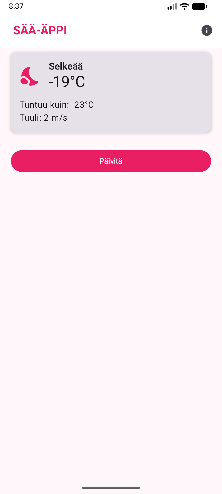
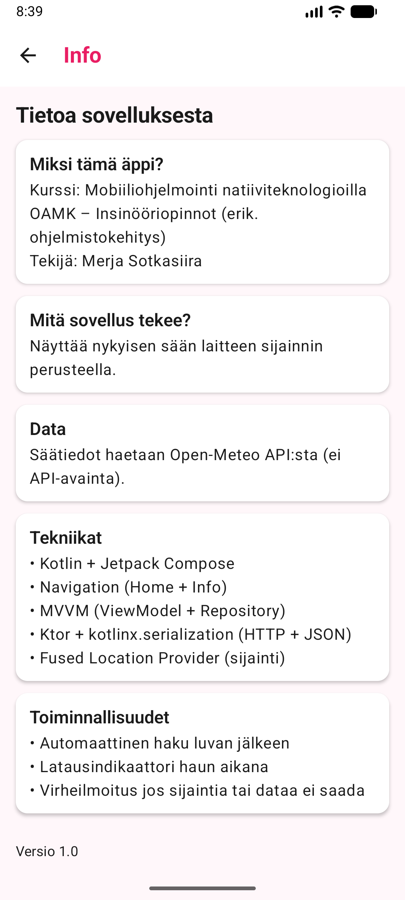

# SÄÄ-ÄPPI 

Pieni Android-sääsovellus, joka hakee käyttäjän sijainnin (pyytää luvan sijaintitietoihin) ja näyttää **nykyisen sään** Open-Meteo API:n avulla.  
Tehty kurssille **Mobiiliohjelmointi natiiviteknologioilla (OAMK, Syksy 2025)**.

Tekijä: **Merja Sotkasiira**  

---

## Screenshotit

  
  &nbsp;&nbsp;&nbsp;&nbsp;&nbsp;&nbsp;
  

---

## Mitä sovellus tekee?

- Hakee laitteen **sijainnin** (Fused Location Provider)
- Hakee **current weather** -datan Open-Meteosta (HTTP)
- Näyttää säätiedot kortissa:
  - lämpötila
  - tuntuu kuin
  - tuulen nopeus
  - ikoni + kuvaus weather_code:n perusteella
- Navigointi kahden ruudun välillä:
  - **Home**
  - **Info**
- Näyttää **loading spinnerin** haun aikana
- Näyttää **virheilmoituksen**, jos sijaintia tai dataa ei saada
- Oma teema (pinkki 😄)

---

## Käytetyt teknologiat / riippuvuudet

- Kotlin
- Jetpack Compose (Material 3)
- Navigation Compose
- MVVM (ViewModel + Repository + UI State)
- Ktor (HTTP client)
- kotlinx.serialization (JSON)
- Google Play Services Location (FusedLocationProviderClient)

---

## Projektin rakenne (lyhyesti)

- `ui/`
  - `screens/` → HomeScreen + InfoScreen
  - `components/` → WeatherCard
  - `theme/` → Color.kt / Theme.kt / Type.kt
- `viewmodels/`
  - `WeatherViewModel` + `WeatherUiState`
- `data/`
  - `WeatherRepository` (API-kutsu)
- `network/`
  - `WeatherClient` (Ktor + JSON)
  - `LocationClient` (sijainti)
- `models/`
  - `WeatherResponse` (API-vastauksen dataluokat)
- `util/`
  - `WeatherCodeMapper` (weather_code → ikoni + kuvaus)

---

## Miten suoritat projektin?

1. Avaa projekti Android Studiossa
2. Sync Gradle
3. Aja emulaattorilla tai omalla laitteella

### Oikeudet
Sovellus tarvitsee sijaintiluvan:
- `ACCESS_FINE_LOCATION` ja `ACCESS_COARSE_LOCATION`
Lisäksi:
- `INTERNET`

---

## Emulaattori: sijainti (tärkeä!)

Jos saat “väärän sään”, syy on lähes aina se, että emulaattori käyttää oletussijaintia.

1. Emulator → **Extended controls** → **Location**
2. Lisää/valitse piste (esim. Oulu/Helsinki)
3. Paina **Set/Send location**

Vinkki: pelkkä “Enable GPS signal” ei aina riitä, sijainti pitää oikeasti “lähettää”.

Esimerkkikoordinaatit:
- Oulu: `65.0121, 25.4651`

---

## API

Säätiedot: **Open-Meteo**  
Ei tarvitse API-avainta.

Käytössä on `/v1/forecast` ja `current=...` kentät (lämpötila, tuntuu kuin, sääkoodi, tuuli jne.).

---

## Lisenssi

Tämä projekti on kurssitehtävä. Voit katsoa ja oppia koodista vapaasti.
